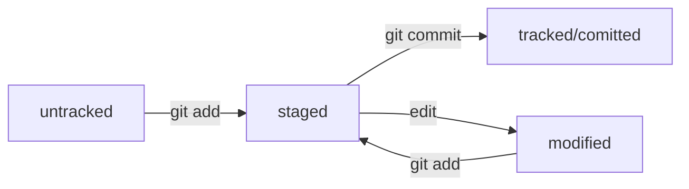

# Ya_WS_Git

---

## Lnk

### Covenants

[Comm:KW(rfc2119)](https://datatracker.ietf.org/doc/html/rfc2119 "Key words for use in RFCs to Indicate Requirement Levels")  
[Semantic Ver](https://semver.org/lang/ru/ "Семантическое Версионирование")  
[Commit Message Format](https://www.conventionalcommits.org/ru/v1.0.0-beta.4/ "Commit Message Format")  
[Commit Message Format(Angular)](https://github.com/angular/angular/blob/main/CONTRIBUTING.md#-commit-message-format "Contributing to Angular - Commit Message Format")  

### GitHub

[Beg](https://docs.github.com/ru/get-started/writing-on-github/getting-started-with-writing-and-formatting-on-github "Основные сведения о подготовке материалов и форматировании на GitHub")  
[FMS](https://github.github.com/gfm/ "GitHub Flavored Markdown Spec")  
[Markdown Cheat Sheet  Markdown Guide](https://www.markdownguide.org/cheat-sheet/)  


---

## Ts

### Emphasis

Emphasis, aka italics, with *asterisks* or _underscores_.

Strong emphasis, aka bold, with **asterisks** or __underscores__.

Combined emphasis with **asterisks and _underscores_**.

Strikethrough uses two tildes. ~~Scratch this.~~

This ~~has a

new paragraph~~.

### Lists

1. First ordered list item
2. Another item
   * Unordered sub-list. 
1. Actual numbers don't matter, just that it's a number
   1. Ordered sub-list
   2. Ordered sub-list 2
2. And another item.  
   + Unordered sub-list. 
   * Unordered sub-list. 
   
        Some text that should be aligned with the above item.

    Some text that should be aligned with the above item.
Some text that should be aligned with the above item.

Some text that should be aligned with the above item.

* Unordered list can use asterisks
- Or minuses
+ Or pluses
*

### Math(\$$TeX$\$)

* $-b \pm \sqrt{b^2 - 4ac} \over 2a$

    ```tex
    -b \pm \sqrt{b^2 - 4ac} \over 2a
    ```


* $x = a_0 + \frac{1}{a_1 + \frac{1}{a_2 + \frac{1}{a_3 + a_4}}}$

    ```tex
    x = a_0 + \frac{1}{a_1 + \frac{1}{a_2 + \frac{1}{a_3 + a_4}}}
    ```


* $\forall x \in X, \quad \exists y \leq \epsilon$

    ```tex
    \forall x \in X, \quad \exists y \leq \epsilon
    ```

---

## Шпаргалка. Базовые команды в консоли

### Навигация

-   `pwd` (от англ. _**p**rint **w**orking **d**irectory_, «показать рабочую папку») — покажи, в какой я папке;
-   `ls` (от англ. _**l**i**s**t directory contents_, «отобразить содержимое директории») — покажи файлы и папки в текущей папке;
-   `ls -a` — покажи также скрытые файлы и папки, названия которых начинаются с символа `.`;
-   `cd first-project` (от англ. _**c**hange **d**irectory_, «сменить директорию») — перейди в папку `first-project`;
-   `cd first-project/html` — перейди в папку `html`, которая находится в папке `first-project`;
-   `cd ..` — перейди на уровень выше, в родительскую папку;
-   `cd ~` — перейди в домашнюю директорию (`/Users/Username`);
-   `cd /` — перейди в корневую директорию.

### Работа с файлами и папками

**Создание**

-   `touch index.html` (англ. _touch,_ «коснуться») — создай файл `index.html` в текущей папке;
-   `touch index.html style.css script.js` — если нужно создать сразу несколько файлов, можно напечатать их имена в одну строку через пробел;
-   `mkdir second-project` (от англ. _**m**a**k**e **dir**ectory_, «создать директорию») — создай папку с именем `second-project` в текущей папке.

**Копирование и перемещение**

-   `cp file.txt ~/my-dir` (от англ. _**c**o**p**y_, «копировать») — скопируй файл в другое место;
-   `mv file.txt ~/my-dir` (от англ. _**m**o**v**e_, «переместить») — перемести файл или папку в другое место.

**Чтение**

-   `cat file.txt` (от англ. _con**cat**enate and print_, «объединить и распечатать») — распечатай содержимое текстового файла `file.txt`.

**Удаление**

-   `rm about.html` (от англ. _**r**e**m**ove_, «удалить») — удали файл `about.html`;
-   `rmdir images` (от англ. _**r**e**m**ove **dir**ectory_, «удалить директорию») — удали папку `images`;
-   `rm -r second-project` (от англ. _**r**e**m**ove,_ «удалить» + _**r**ecursive_, «рекурсивный») — удали папку `second-project` и всё, что она содержит.

### Полезные возможности

-   Команды необязательно печатать и выполнять по очереди. Можно указать их списком — разделить двумя амперсандами (`&&`).
-   У консоли есть собственная память — буфер с несколькими последними командами. По ним можно перемещаться с помощью клавиш со стрелками вверх (**`↑`**) и вниз (**`↓`**).
-   Чтобы не вводить название файла или папки полностью, можно набрать первые символы имени и дважды нажать `Tab`. Если файл или папка есть в текущей директории, командная строка допишет путь сама.
    
    Например, вы находитесь в папке `dev`. Начните вводить `cd first` и дважды нажмите `Tab`. Если папка `first-project` есть внутри `dev`, командная строка автоматически подставит её имя. Останется только нажать `Enter`.

---

## Шпаргалка. Начало работы с Git

### Инициализация репозитория

`git init` (от англ. _**init**ialize_, «инициализировать») — инициализируй репозиторий.

### Синхронизация локального и удалённого репозиториев

`git remote add origin https://github.com/YandexPracticum/first-project.git` (от англ. _remote_, «удалённый» + _add,_ «добавить») — привяжи локальный репозиторий к удалённому с URL `https://github.com/YandexPracticum/first-project.git`;

`git remote -v` (от англ. _**v**erbose_, «подробный») — проверь, что репозитории действительно связались;

`git push -u origin main` (от англ. _push_, «толкать») — в первый раз загрузи все коммиты из локального репозитория в удалённый с названием `origin`.

* 💡 Ваша ветка может называться `master`, а не `main`. Подправьте команду, если это необходимо.

`git push` (от англ. _push_, «толкать») — загрузи коммиты в удалённый репозиторий после того, как он был привязан с помощью флага `-u`.

### Staging area, index и cache

  **Staging area** также называют **index** (англ. «каталог») или **cache** (англ. «кеш»), а состояние файла `staged` иногда называют `indexed` или `cached`. 
  Все три варианта могут встречаться в документации и в качестве флагов команд Git. А также в интернете — например, в вопросах и ответах [на сайте Stack Overflow](https://stackoverflow.com/).



### Подготовка файла к коммиту

`git add todo.txt` (от англ. _add_, «добавить») — подготовь файл `todo.txt` к коммиту;

`git add --all` (от англ. _add_, «добавить» + _all_, «всё») — подготовь к коммиту сразу все файлы, в которых были изменения, и все новые файлы;

`git add .` — подготовь к коммиту текущую папку и все файлы в ней.

### Создание и публикация коммита

`git commit -m "Комментарий к коммиту."` (от англ. _commit,_ «совершать», фиксировать» + _**m**essage,_ «сообщение») — сделай коммит и оставь комментарий, чтобы было проще понять, какие изменения сделаны;

`git push` (от англ. _push_, «толкать») — добавь изменения в удалённый репозиторий.

### Просмотр информации о коммитах

`git log` (от англ. _log_, «журнал \[записей\]») — выведи подробную историю коммитов;

`git log --oneline` (от англ. _log_, «журнал \[записей\]» + _oneline_, «одной строкой») — покажи краткую информацию о коммитах: сокращённый хеш и сообщение.

### Просмотр состояния файлов

`git status` (от англ. _status_, «статус», «состояние») — покажи текущее состояние репозитория.

### Добавление изменений в последний коммит

`git commit --amend --no-edit` (от англ. _amend_, «исправить») — добавь изменения к последнему коммиту и оставь сообщение прежним;

`git commit --amend -m "Новое сообщение"` — измени сообщение к последнему коммиту на `Новое сообщение`.

* 💡 Выйти из редактора Vim: нажать `Esc`, ввести `:qa!`, нажать `Enter`.

### «Откат» файлов и коммитов

`git restore --staged hello.txt` (от англ. _restore_, «восстановить») — переведи файл `hello.txt` из состояния `staged` обратно в `untracked` или `modified`;

`git restore hello.txt` — верни файл `hello.txt` к последней версии, которая была сохранена через `git commit` или `git add`;

`git reset --hard b576d89` (от англ. _reset_, «сброс», «обнуление» + _hard_, «суровый») — удали все незакоммиченные изменения из staging и «рабочей зоны» вплоть до указанного коммита.

### Просмотр изменений

`git diff` (от англ. _**diff**erence_, «отличие», «разница») — покажи изменения в «рабочей зоне», то есть в `modified`\-файлах;

`git diff a9928ab 11bada1` — выведи разницу между двумя коммитами;

`git diff --staged` — покажи изменения, которые добавлены в `staged`\-файлах.
